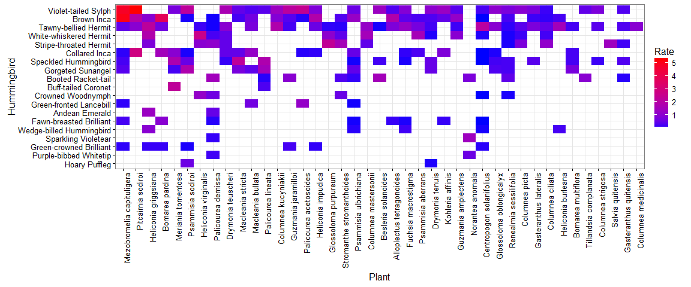
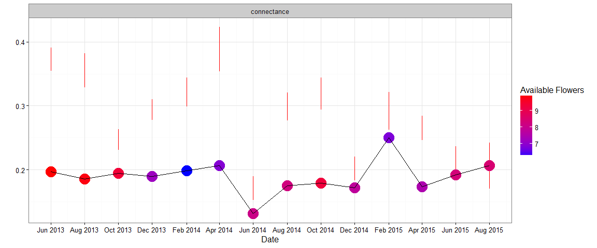
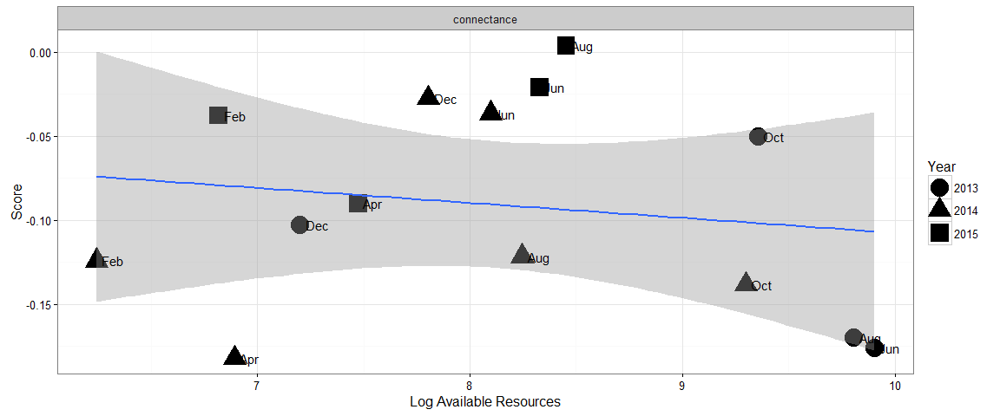

# Appendix  B - Network Statistics.
Ben Weinstein  
2/1/2016  


```
## [1] "Run Completed at 2016-06-03 15:44:12"
```


************


#Read in data


#Daily interaction rate


#Overall Network

## Ordered by interactions



##Ordered by traits


##Calculate overall statistics.


## Permutation tests

We want to randomize the underlying total matrix, then recalculate daily interaction rates. We maintain column sums since cameras were placed at individual flowers, those identities are fixed through sampling. It is only the identity of hummingbirds that could vary in create realistic alternative networks. 

### Calculate randomized matrix

Maintaining the total number of observations, but shuffling where those visitations fall.


```
## png 
##   2
```

#Temporal change in network

##View Sub-Networks


## Randomize with respect to sampling


###Apply function to each period




## Difference from expected


##Resource Regression




