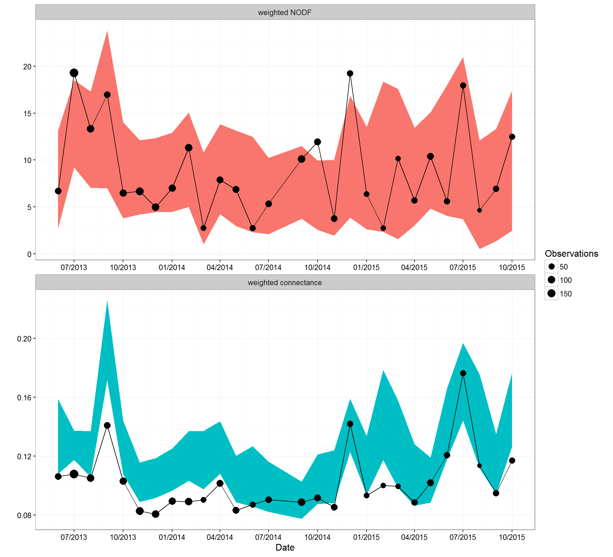
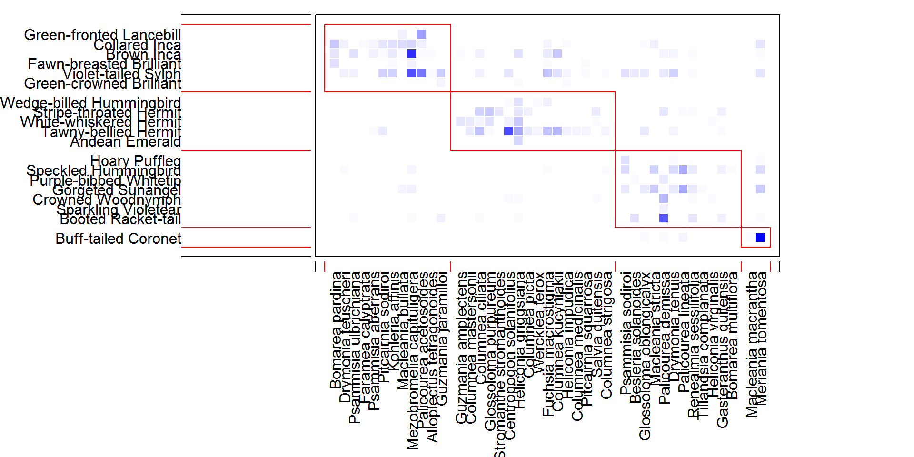
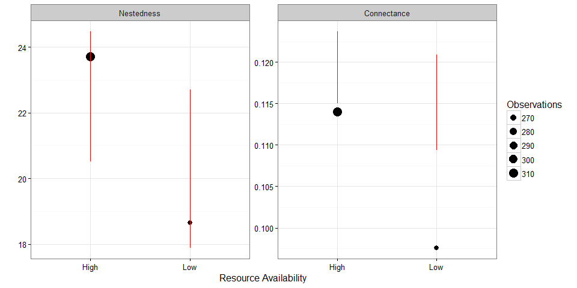
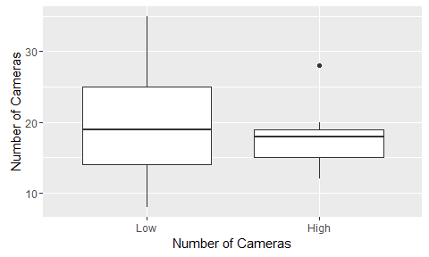

# Appendix  B - Network Statistics.
Ben Weinstein  
2/1/2016  


```
## [1] "Run Completed at 2016-02-01 16:00:02"
```


************


#Flower Availability  by Month




#Overall Network


##Calculate overall statistics.


## Permutation tests

There is some discussion as to what the best null model for nestedness is. Should we constrain the matrix? Try both ways to see if it makes a difference in inference.

### Maintaining row and column sums




### Maintaining no sums


```
## png 
##   2
```

#Temporal change in network


**Measures of hummingbird plant interactions through time (points) as compared to a null model maintaining the number of observations (shaded region).The size of the point is proportional to the number of interactions measured for each month.**

#Network Measures as a function of Resources


## Discrete Boxplots

Given the dramatic variation in flower availability, a linear relationship doesn't capture the huge change in resource pulses.




#Sampling and Metrics

Did we sample more in high or low periods?



No, there is variance, but not really in one direction of the other.


##Linear regression

Treated as a continious variable, is change in flowers predictive of change in network properties?


```
## 
## Call:
## lm(formula = value ~ log(Flowers), data = network.fl[network.fl$Metric %in% 
##     "weighted connectance", ])
## 
## Residuals:
##       Min        1Q    Median        3Q       Max 
## -0.018240 -0.011229 -0.003613  0.006985  0.050106 
## 
## Coefficients:
##              Estimate Std. Error t value Pr(>|t|)  
## (Intercept)  0.050952   0.025870   1.970   0.0616 .
## log(Flowers) 0.006652   0.003091   2.152   0.0426 *
## ---
## Signif. codes:  0 '***' 0.001 '**' 0.01 '*' 0.05 '.' 0.1 ' ' 1
## 
## Residual standard error: 0.01634 on 22 degrees of freedom
## Multiple R-squared:  0.1739,	Adjusted R-squared:  0.1364 
## F-statistic: 4.632 on 1 and 22 DF,  p-value: 0.04262
```

```
## 
## Call:
## lm(formula = value ~ log(Flowers), data = network.fl[network.fl$Metric %in% 
##     "weighted NODF", ])
## 
## Residuals:
##     Min      1Q  Median      3Q     Max 
## -7.0501 -2.2849 -0.0813  2.5951  7.7828 
## 
## Coefficients:
##              Estimate Std. Error t value Pr(>|t|)   
## (Intercept)  -10.1796     6.4678  -1.574  0.12979   
## log(Flowers)   2.2446     0.7727   2.905  0.00821 **
## ---
## Signif. codes:  0 '***' 0.001 '**' 0.01 '*' 0.05 '.' 0.1 ' ' 1
## 
## Residual standard error: 4.084 on 22 degrees of freedom
## Multiple R-squared:  0.2772,	Adjusted R-squared:  0.2444 
## F-statistic: 8.438 on 1 and 22 DF,  p-value: 0.008215
```

```
## 
## Call:
## lm(formula = value ~ log(Flowers), data = network.fl[network.fl$Metric %in% 
##     "niche.overlap.HL", ])
## 
## Residuals:
##       Min        1Q    Median        3Q       Max 
## -0.089049 -0.025049 -0.004993  0.017537  0.200391 
## 
## Coefficients:
##              Estimate Std. Error t value Pr(>|t|)  
## (Intercept)  -0.12778    0.09784  -1.306    0.205  
## log(Flowers)  0.03246    0.01169   2.777    0.011 *
## ---
## Signif. codes:  0 '***' 0.001 '**' 0.01 '*' 0.05 '.' 0.1 ' ' 1
## 
## Residual standard error: 0.06179 on 22 degrees of freedom
## Multiple R-squared:  0.2596,	Adjusted R-squared:  0.2259 
## F-statistic: 7.713 on 1 and 22 DF,  p-value: 0.01099
```

Flowers are significant predictors for connectance, nestedness and niche overlap.


