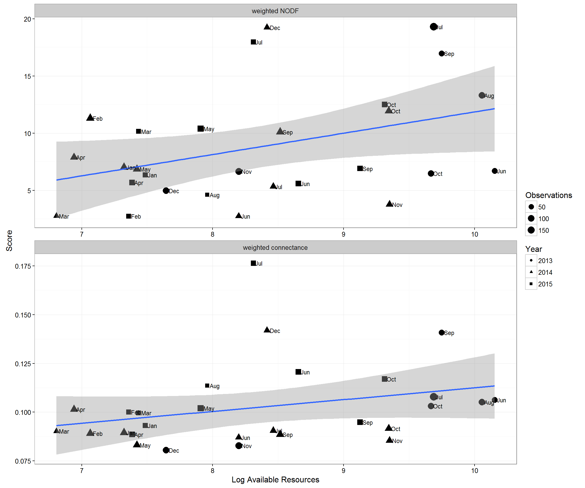
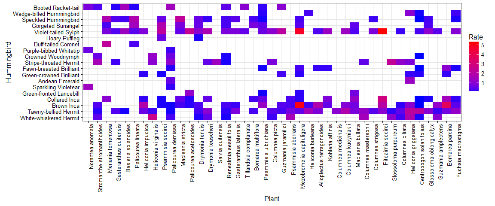
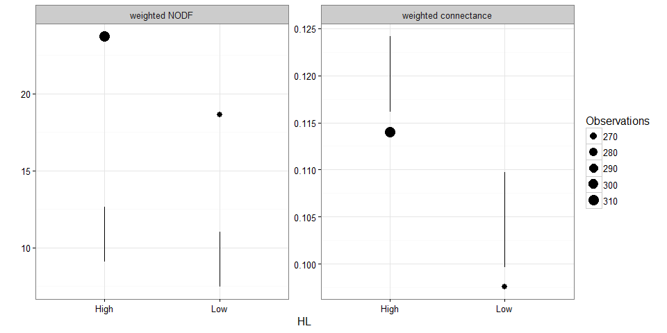

# Appendix  B - Network Statistics.
Ben Weinstein  
2/1/2016  


```
## [1] "Run Completed at 2016-05-31 10:00:03"
```


************


#Read in data

From Generate.Rmd


#Overall Network



##Calculate overall statistics.


## Permutation tests

There is some discussion as to what the best null model for nestedness is. Should we constrain the matrix? Try both ways to see if it makes a difference in inference.

### Calculate randomized matrix

Maintaining the total number of observations, but shuffling where those visitations fall.




```
## png 
##   2
```

#Temporal change in network

##View Sub-Networks


## Null function


###Apply function to each period


#Observed versus null values of nestedness, connectance



#Randomize with respect to resource membership.  


