# Trait-matching and Available Resources: Randomizations
Ben Weinstein - Stony Brook University  


```
## [1] "Run Completed at 2016-01-25 16:33:54"
```


```r
#reload if needed
#load("Randomization.Rdata")
```

#Load in data


```r
#read in flower morphology data, comes from Nectar.R
droppath<-"C:/Users/Ben/Dropbox/"
fl.morph<-read.csv(paste(droppath,"Thesis/Maquipucuna_SantaLucia/Results/FlowerMorphology.csv",sep=""))

#First row is empty
fl.morph<-fl.morph[-1,]

#Bring in Hummingbird Morphology Dataset, comes from
hum.morph<-read.csv(paste(droppath,"Thesis/Maquipucuna_SantaLucia/Results/HummingbirdMorphology.csv",sep=""))

#taxonomy change, we are calling them Crowned Woodnymph's now.
hum.morph$English<-as.character(hum.morph$English)

hum.morph$English[hum.morph$English %in% "Green-crowned Woodnymph"]<-"Crowned Woodnymph"

#Bring in Interaction Matrix
int<-read.csv(paste(droppath,"Thesis/Maquipucuna_SantaLucia/Results/Network/HummingbirdInteractions.csv",sep=""),row.names=1)

#one date error
int[int$DateP %in% '2013-07-25',"Month"]<-7

#Correct known taxonomic disagreements, atleast compared to traits
int[int$Iplant_Double=="Alloplectus purpureus","Iplant_Double"]<-"Glossoloma purpureum"
int[int$Iplant_Double=="Capanea affinis","Iplant_Double"]<-"Kohleria affinis"
int[int$Iplant_Double=="Columnea cinerea","Iplant_Double"]<-"Columnea mastersonii"
int[int$Iplant_Double=="Alloplectus teuscheri","Iplant_Double"]<-"Drymonia teuscheri"
int[int$Iplant_Double=="Drymonia collegarum","Iplant_Double"]<-"Alloplectus tetragonoides"

#Some reasonable level of presences, 25 points
keep<-names(which(table(int$Hummingbird) > 25))

int<-int[int$Hummingbird %in% keep & !int$Hummingbird %in% c("Sparkling Violetear"),]

m.dat<-droplevels(int[colnames(int) %in% c("ID","Video","Time","Hummingbird","Sex","TransectID","Transect_R","Iplant_Double","Pierce","DateP","Month","ele","Type")])

#Does the data come from camera or transect?
m.dat$Type<-(is.na(m.dat$TransectID))*1

m.dat$Year<-years(as.Date(m.dat$DateP))
#one missing date
m.dat$Year[m.dat$Year %in% 2012]<-2013

#Number of bird species
h_species<-nlevels(m.dat$Hummingbird)

#Number of plant species
plant_species<-nlevels(m.dat$Iplant_Double)

#Get english name
dath<-merge(m.dat,hum.morph, by.x="Hummingbird",by.y="English",keep=all)

#Merge to flowers
int.FLlevels<-levels(factor(dath$Iplant_Double))

#Which flowers are we missing info for?
missingTraits<-int.FLlevels[!int.FLlevels %in% fl.morph$X]

#print(paste("Missing Trait Information:",missingTraits))
dath<-merge(dath,fl.morph, by.x="Iplant_Double",by.y="X")

#Drop piercing events, since they don't represent correlation
#dath<-dath[!dath$Pierce %in% c("y","Y"),]
```

##Match Species to Morphology


```r
#observed TotalCorollaing
TotalCorollaF<-abs(t(sapply(hum.morph$Bill,function(x){x-fl.morph$TotalCorolla})))

rownames(TotalCorollaF)<-hum.morph$English
colnames(TotalCorollaF)<-fl.morph$Group.1
```


```r
#match names #Round to 2 decimals #Convert to cm for winbugs, avoids numerical underflow
TotalCorollaT<-round(TotalCorollaF[rownames(TotalCorollaF) %in% dath$Hummingbird,colnames(TotalCorollaF) %in% dath$Iplant_Double],2)/10

TotalCorollaT<-TotalCorollaT[sort(rownames(TotalCorollaT)),sort(colnames(TotalCorollaT))]
```

##Elevation ranges

Create a binary variable whether each observation was in a low elevation or high elevation transect. We have some species that just occur at the top of the gradient, and are not present in the sampling window of flowers at the low elevation.

Accounting for non-availability.
We have to figure out which plants were sampled in which periods, and if it was sampled, the non-detection are 0 if it wasn't the non-detection are NA. then remove all the Na's.


```r
elevH<-read.csv("InputData/HummingbirdElevation.csv",row.names=1)
head(elevH)
```

```
##                 Hummingbird  Low        m   High Index
## 1            Andean Emerald 1378 1378.632 1380.0     1
## 2    White-whiskered Hermit 1340 1437.024 1614.2     1
## 3    Stripe-throated Hermit 1360 1455.084 1527.4     1
## 4         Crowned Woodnymph 1360 1523.420 2049.0     1
## 5 Rufous-tailed Hummingbird 1370 1531.929 1862.0     3
## 6  Wedge-billed Hummingbird 1331 1624.850 2003.0     3
```

```r
colnames(elevH)[5]<-"Elevation"
elevH$Bird<-1:nrow(elevH)

#high elevation or low elevation
elevP<-read.csv("InputData/PlantElevation.csv",row.names=1)
colnames(elevP)[5]<-"Elevation"
elevP$Plant<-1:nrow(elevP)
elevP$Iplant_Double<-as.character(elevP$Iplant_Double)

#Correct known taxonomic errors
elevP[elevP$Iplant_Double %in% "Alloplectus purpureus","Iplant_Double"]<-"Glossoloma purpureum"
elevP[elevP$Iplant_Double %in% "Capanea affinis","Iplant_Double"]<-"Kohleria affinis"
elevP[elevP$Iplant_Double %in% "Alloplectus teuscheri","Iplant_Double"]<-"Drymonia teuscheri"
elevP[elevP$Iplant_Double %in% "Columnea cinerea","Iplant_Double"]<-"Columnea mastersonii"
elevP[elevP$Iplant_Double %in% "Alloplectus tenuis","Iplant_Double"]<-"Drymonia tenuis"

#Merge to observed Data
#plants
dathp<-merge(dath,elevP,by="Iplant_Double")

#birds
datph<-merge(dathp,elevH,by="Hummingbird")
```

What elevation transect is each observation in?
The camera data need to be inferred from the GPS point.


```r
#cut working best on data.frame
datph<-as.data.frame(datph)

#which elevation bin is each observation within
labs<-paste(seq(1300,2500,200),seq(1500,2700,200),sep="_")

#for the couple points that have 1290 elevation, round up to 300 for convienance
datph$ele[datph$ele < 1300]<-1301
datph$Transect_R[is.na(datph$Transect_R)]<-as.character(cut(datph[is.na(datph$Transect_R),]$ele,seq(1300,2700,200),labels=labs))

#Elev for the transects is the midpoint
tran_elev<-datph[datph$Survey_Type=='Transect',"Transect_R"]
datph[datph$Survey_Type=='Transect',"ele"]<-sapply(tran_elev,function(x){
  mean(as.numeric(str_split(x,"_")[[1]]))
})

#one missing?
datph[datph$ID %in% "FL064","Transect_R"]<-c("1300_1500")
```

### Summarize Observations


```r
#ID for NA is holger transects, make the id's 1:n for each day of transect at each elevation, assuming no elevation was split across days.
datph$ID<-as.character(datph$ID)

noid<-datph[is.na(datph$ID),]

id_topaste<-paste(noid$Transect_R,noid$DateP,"Transect",sep="_")
datph[which(is.na(datph$ID)),"ID"]<-id_topaste

#Create year month combination
datph$Time<-paste(datph$Month,datph$Year,datph$Transect_R,sep="_")

#Label survey type
datph$Survey_Type<-NA

mt<-!is.na(datph$TransectID)*1
datph$Survey_Type[mt==1]<-"Transect"
datph$Survey_Type[!datph$Survey_Type %in% "Transect"]<-"Camera"

indatraw<- datph %>% select(Bird,Plant,Hummingbird,Iplant_Double,ID,Time,ele,Month,Year,TransectID,Transect_R,Survey_Type,TotalCorolla,Bill,DateP)
indatraw$Yobs<-1

#add day ID
sdat<-split(indatraw,list(indatraw$ID),drop = T)

sdat<-lapply(sdat,function(x){
  x<-droplevels(x)
  x$Day<-as.numeric(as.factor(x$DateP))
  return(x)
})

indatraw<-rbind_all(sdat)
```


```r
#match the traits
traitmelt<-melt(TotalCorollaT)
colnames(traitmelt)<-c("Hummingbird","Iplant_Double","Traitmatch")
```

##Absences - accounting for non-detection

We have more information than just the presences, given species elevation ranges, we have absences as well. Absences are birds that occur at the elevation of the plant sample, but were not recorded feeding on the flower.


```r
indatlong<-acast(indatraw,Bird~Plant~ID~Day,value.var="Yobs",fun.aggregate = length)

indatlong[is.na(indatlong)]<-0
```


```r
#Only non-detections are real 0's, the rest are NA's and are removed.
#Plants not surveyed in that time period
#Hummingbirds not present at that elevation

  for(x in 1:dim(indatlong)[3]){
  
  #Remove non sampled plants 
  a<-indatlong[,,x,]

  #No observations at that plant
  toNA<-as.numeric(names(which(apply(a,2,sum)==0)))
  pres<-as.numeric(names(which(!apply(a,2,sum)==0)))
  indatlong[,colnames(a) %in% toNA,x,]<-NA

  if(length(pres)==0){next} else {

  #Get elevation point of that sampling event
  cam<-dimnames(indatlong)[[3]][x]
  camelev<-    indatraw %>% filter(ID==cam)  %>% .$ele %>% mean()
  
  #for each hummingbird, was that camera within elevation?
  for(i in 1:dim(a)[1]){
      low<-elevH[elevH$Bird == rownames(a)[i],"Low"]
      high<-elevH[elevH$Bird == rownames(a)[i],"High"]
        
        #if not in elev range, set to NA
        
        if(!((low < camelev) & (camelev < high))){
            if(sum(indatlong[i,,x,],na.rm=T)>0){next}
          #if you had a wandering individual outside range, allow interaction to occur.
                indatlong[i,,x,]<-NA
        }
      }
    }
  }

### There can't be absences in days that weren't sampled.
for (x in 1:dim(indatlong)[3]){
  cam<-indatlong[,,x,]
  for (y in 1:dim(cam)[3]){
    sc<-sum(cam[,,y],na.rm=T)
    if (sc ==0){
      indatlong[,,x,y]<-NA
    }
  }
}


#melt and remove Na's
indat<-melt(indatlong)

#get only absence data
indat<-indat[indat$value %in% 0,]

colnames(indat)<-c("Bird","Plant","ID","Day","Yobs")
```


```r
#remerge the time period data for absences
Timelookup<-indatraw %>% dplyr::select(ID,Transect_R,Survey_Type,Month,Year,Day,DateP) %>% unique()

#Get time information
indat<-merge(indat,Timelookup,by=c("ID","Day"))

#bind to presence data
indat<-as.data.frame(rbind_all(list(indat,indatraw)))

#Species names
for (x in 1:nrow(indat)){
  indat$Hummingbird[x]<-as.character(elevH[elevH$Bird %in% indat$Bird[x],"Hummingbird"])
  indat$Iplant_Double[x]<-as.character(elevP[elevP$Plant %in% indat$Plant[x],"Iplant_Double"])
}

#Traits
for (x in 1:nrow(indat)){
  indat$Hummingbird[x]<-as.character(elevH[elevH$Bird %in% indat$Bird[x],"Hummingbird"])
  indat$Iplant_Double[x]<-as.character(elevP[elevP$Plant %in% indat$Plant[x],"Iplant_Double"])
}

indat<-indat[,!colnames(indat) %in% c("Bill","TotalCorolla","Time","ele","TransectID")]

indat<-merge(indat,hum.morph[,colnames(hum.morph) %in% c("English","Bill")],by.x="Hummingbird",by.y="English")
indat<-merge(indat,fl.morph[,c("Group.1","TotalCorolla")],by.x="Iplant_Double",by.y="Group.1")
#Billd
indat<-merge(indat,traitmelt,by=c("Hummingbird","Iplant_Double"))
```

Reformat index for jags.
Jags needs a vector of input species 1:n with no breaks.


```r
#Easiest to work with jags as numeric ordinal values
indat$Hummingbird<-as.factor(indat$Hummingbird)
indat$Iplant_Double<-as.factor(indat$Iplant_Double)
indat$jBird<-as.numeric(indat$Hummingbird)
indat$jPlant<-as.numeric(indat$Iplant_Double)

jagsIndexBird<-data.frame(Hummingbird=levels(indat$Hummingbird),jBird=1:length(levels(indat$Hummingbird)))
 
jagsIndexPlants<-data.frame(Iplant_Double=levels(indat$Iplant_Double),jPlant=1:length(levels(indat$Iplant_Double)))

#Similiarly, the trait matrix needs to reflect this indexing.
jTotalCorolla<-TotalCorollaT[rownames(TotalCorollaT) %in% unique(indat$Hummingbird),colnames(TotalCorollaT) %in% unique(indat$Iplant_Double)]
```

#Resources at each point

In our model the covariate is indexed at the scale at which the latent count is considered fixed. This means we need the resource availability per month across the entire elevation gradient for each point.


```r
#Get flower transect data
full.fl<-read.csv("C:/Users/Ben/Dropbox/Thesis/Maquipucuna_SantaLucia/Results/FlowerTransects/FlowerTransectClean.csv")[,-1]

 #month should be capital 
colnames(full.fl)[colnames(full.fl) %in% "month"]<-"Month"

#Be conservative, only use plants for which there were any observed records, for any species, that way we know we are just looking at hummingbird visited flowers, it can be difficult to guess in the field (faramea calyptrata? Clusia? It gets tricky.)

full.fl<-full.fl %>% filter(Iplant_Double %in% unique(int$Iplant_Double))

#group by month and replicate, remove date errors by making a max of 10 flowers, couple times where the gps places it in wrong transect by 1 to 2 meters. 
flower.month<-group_by(full.fl,Month,Year,Transect_R,Date_F) %>% dplyr::summarise(Flowers=sum(Total_Flowers,na.rm=TRUE))  %>% filter(Flowers>10)
  
#Make month abbreviation column, with the right order
flower.month$Month.a<-factor(month.abb[flower.month$Month],month.abb[c(1:12)])

#Make year factor column
flower.month$Year<-as.factor(flower.month$Year)

#get quantile for each transect
thresh<-melt(flower.month %>% group_by() %>%  summarize(Upper=quantile(Flowers,0.75),Lower=quantile(Flowers,0.5)))


  flower.month$High<-cut(flower.month$Flowers,c(0,thresh[thresh$variable %in% "Lower","value"],thresh[thresh$variable %in% "Upper","value"],max(flower.month$Flowers)+1),labels=c("Low","Medium","High"))


#fix the levels
levels(flower.month$Transect_R)<-c("1300m - 1500m", "1500m - 1700m","1700m - 1900m","1900m - 2100m","2100m - 2300m","2300m - 2500m")

#plot
ggplot(flower.month,aes(x=Month.a,log(Flowers),col=High,shape=as.factor(Year))) + geom_point(size=3) + theme_bw()  + geom_smooth(aes(group=1)) + ylab("Flowers") + xlab("Month") + facet_wrap(~Transect_R,scales="free_y") + labs(shape="Year", y= "Log Available Flowers") + scale_x_discrete(breaks=month.abb[seq(1,12,2)]) + scale_color_manual(labels=c("Low","Medium","High"),values=c("blue","gray","red")) + labs(col="Resource Availability") 
```


```r
ggsave("Figures/FlowerAvailability.jpg",height=5.5,width=9,dpi=600)
#turn min and max elvation into seperate columns for the range
flower.month$minElev<-as.numeric(str_extract(flower.month$Transect_R,"(\\d+)"))
flower.month$maxElev<-as.numeric(str_match(flower.month$Transect_R,"(\\d+)_(\\d+)")[,3])
```

##Binary Measures of Resources


```r
#dplyr doesn't like date columns
indat$DateP<-as.character(indat$DateP)

#All Resources
levels(flower.month$Transect_R)<-levels(as.factor(indat$Transect_R))

#Average the two transects per month
  mflower<-flower.month %>% group_by(Transect_R,Month,Year) %>% summarize(Flowers=mean(Flowers))
  
    flt<-mflower %>% group_by() %>% summarize(High=quantile(Flowers,0.66),Low=quantile(Flowers,0.5))

    mflower$Availability<-cut(mflower$Flowers,c(0,flt$Low,flt$High,max(mflower$Flowers)+1),labels=c("Low","Medium","High"))

#     #split to set threshold
#     mflower<-split(mflower,mflower$Transect_R)
#     
#     mflower<-lapply(mflower,function(x){
#       threshr<-flt[flt$Transect_R %in% x$Transect_R,]
#       x$Availability<-cut(x$Flowers,c(0,threshr$Low,threshr$High,max(x$Flowers)+1),labels=c("Low","Medium","High"))
#       return(x)
#     })

    #mflower<-rbind_all(mflower)
    
 indat<-merge(indat,mflower,by=c("Month","Year","Transect_R"))


ggplot(mflower,aes(x=factor(Availability),y=log(Flowers),fill=Transect_R)) + geom_boxplot() + labs(x="Resource Availability") +ggtitle("Resource classification by elevation")
```

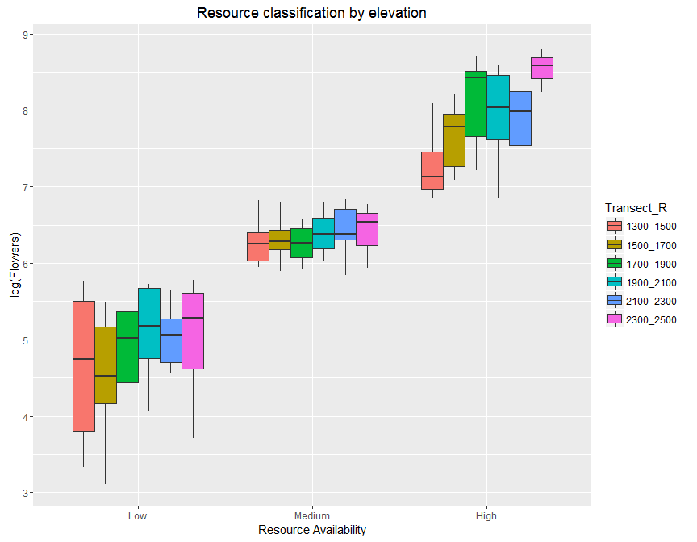

```r
#for the moment take medium out
indat<-indat[!indat$Availability %in% "Medium",]
```

#Corolla distributions


```r
#used versus unused flowers
indat$State<-(indat$Yobs>0)*1
indat$State<-factor(indat$State,labels = c("Unused","Used"))

b<-indat %>% group_by(Hummingbird) %>% summarise(Bill=unique(Bill))

#order by bill length
indat$Hummingbird<-factor(indat$Hummingbird,levels=b %>% arrange(Bill) %>% .$Hummingbird)

ggplot(indat,aes(x=TotalCorolla,fill=State)) + geom_density(alpha=.5) + facet_wrap(~Hummingbird,scales="free") + theme_bw() + geom_vline(data=b,aes(xintercept=Bill),linetype="dashed") +  scale_fill_manual("",values=c("grey90","black"),labels=c("Non-visited","Visited")) + xlab("Flower Corolla Length (mm)") + scale_x_continuous(limits=c(0,71),breaks=c(0,20,40,60))
```

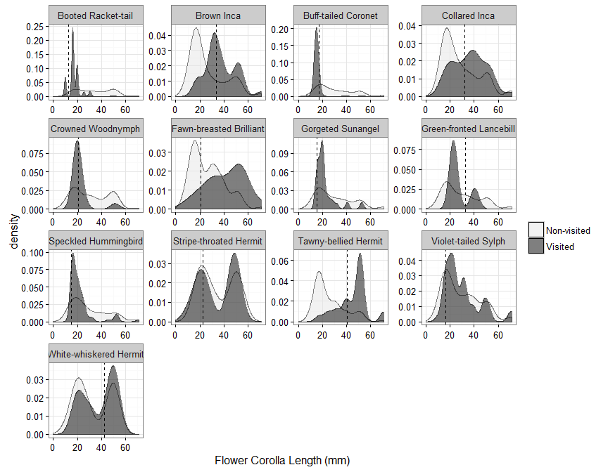

```r
ggsave("Figures/Used_Background.svg",height=9,width=11)
```

View species identity in resource splits.


```r
indat<-droplevels(indat)
#Count of species in both time sets
splist<-indat %>% filter(State=="Used") %>% group_by(Hummingbird,Resource=Availability) %>% distinct(Iplant_Double) %>% dplyr::select(Iplant_Double)

#relevel text

splist<-split(splist,splist$Hummingbird)
p<-list()
for (x in 1:length(splist)){
  split_sp<-split(splist[[x]]$Iplant_Double,splist[[x]]$Resource)
  p[[x]]<-venn.diagram(split_sp,filename=NULL,scaled=T,main =unique(splist[[x]]$Hummingbird),fill=c("Blue","Red"),alpha=c(.25,.75),cat.cex=1.5,cex=.75,main.cex=2)

  #get index
  labs<-lapply(p[[x]],function(i) i$label)
  
  in_low<-which(labs == "Low")

  in_high<-which(labs == "High")

#edit labels, depends on length
#which is low
  if(length(p[[x]])==10){
  p[[x]][[in_low-3]]$label<-paste(split_sp$Low[!split_sp$Low %in% split_sp$High],collapse="\n")

  p[[x]][[in_high-3]]$label<-paste(split_sp$High[!split_sp$High %in% split_sp$Low],collapse="\n")
  }
  
  if(length(p[[x]])==9 & !is.null(labs[[4]])){
      p[[x]][[in_low-3]]$label<-paste(split_sp$Low[!split_sp$Low %in% split_sp$High],collapse="\n")

  p[[x]][[in_high-1]]$label<-paste(split_sp$High[!split_sp$High %in% split_sp$Low],collapse="\n")
  }
  if(length(p[[x]])==9 & is.null(labs[[4]])){
      p[[x]][[in_low-2]]$label<-paste(split_sp$Low[!split_sp$Low %in% split_sp$High],collapse="\n")

  p[[x]][[in_high-2]]$label<-paste(split_sp$High[!split_sp$High %in% split_sp$Low],collapse="\n")
  }
  grid.newpage()
  grid.draw(p[[x]])
}
```

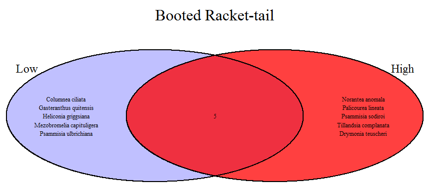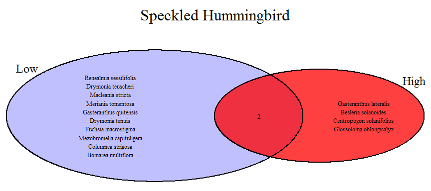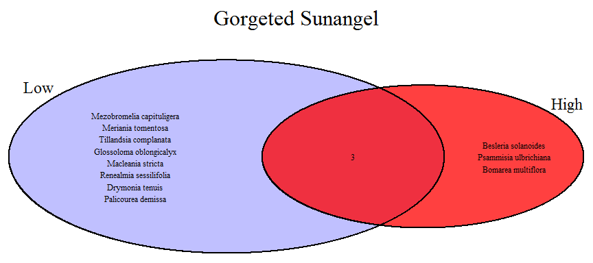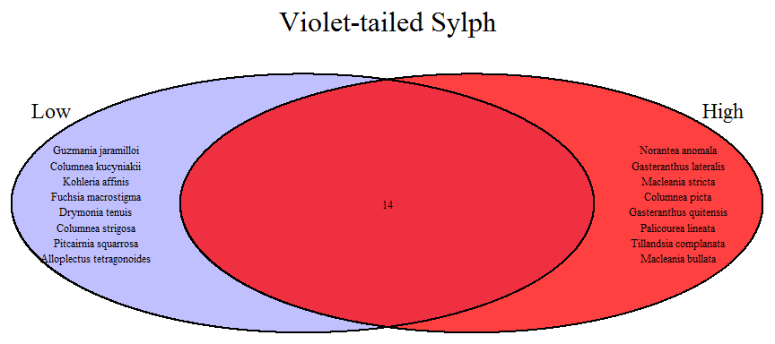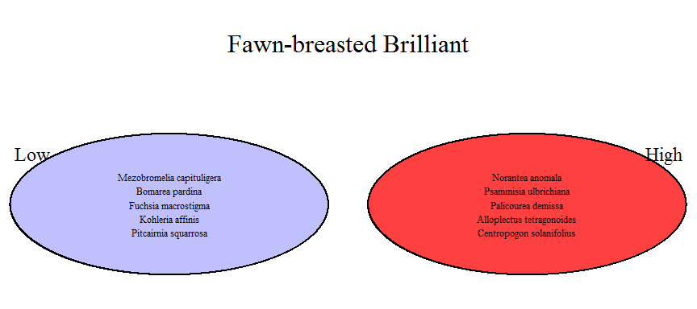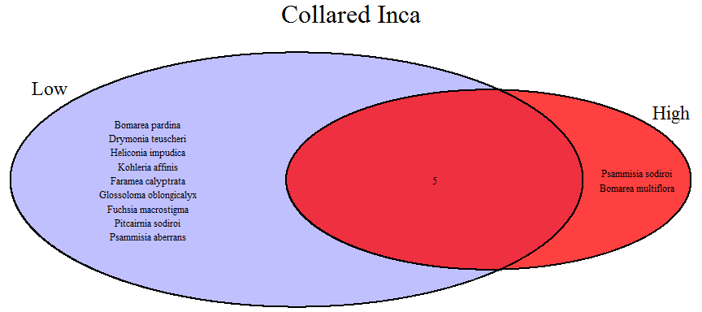

```r
#venn diagram writes a silly set of log files
file.remove(list.files(pattern="*.log"))
```

```
## [1] TRUE TRUE TRUE TRUE TRUE TRUE
```


#Distribution of corolla lengths over time


```r
full.morph<-merge(full.fl,fl.morph,by.x="Iplant_Double",by.y="Group.1")

#turn month into abreviation
full.morph$MonthA<-sapply(full.morph$Month,function(x){
  return(month.abb[x])
})
full.morph$MonthA<-factor(full.morph$MonthA,levels=month.abb)

flower.month$MonthA<-flower.month$Month.a
full.morph<-merge(full.morph,mflower,by=c("Month","Year","Transect_R"))

#
ggplot(full.morph,aes(x=MonthA,fill=as.factor(Year),y=TotalCorolla)) + geom_boxplot() + labs(fill="Year",y="Corolla Length (mm)",x=NULL) + scale_fill_manual(values=c("grey60","grey40","grey10")) + theme_bw() 
```


```r
ggsave("Figures/CorollaAvailability.jpg",dpi=300,height=5,width=7)
```

#Randomization 1

##Is the observed distribution of choosen corollas different than the background distribution of availabile corollas.

This is most common definition of specialization.


```r
#true state
true_state<- indat %>% filter(State=="Used") %>% group_by(Hummingbird) %>% summarize(mean=mean(TotalCorolla),sd=sd(TotalCorolla))

mtruestate<-melt(true_state,measure.vars=c("mean","sd"))

nullc<-function(indat){
  indat$State<-sample(indat$State)
null_state<- indat %>% filter(State=="Used") %>% group_by(Hummingbird) %>% summarize(mean=mean(TotalCorolla),sd=sd(TotalCorolla))

  return(null_state)
}

cl<-makeCluster(5,"SOCK")
registerDoSNOW(cl)
nullframe<-foreach(x=1:10000,.packages="dplyr") %dopar% {nullc(indat)}
stopCluster(cl)

names(nullframe)<-1:10000
nullframe<-melt(nullframe,id.vars=c("Hummingbird"))
```

#Compare null and observed distributions

## Mean


```r
ggplot(nullframe[nullframe$variable=="mean",],aes(x=value)) + geom_density(fill="black",alpha=.2) + geom_vline(data=mtruestate[mtruestate$variable=="mean",],aes(xintercept=value),linetype="dashed",col="red",size=1) + facet_wrap(~Hummingbird,scales="free") + theme_bw() 
```

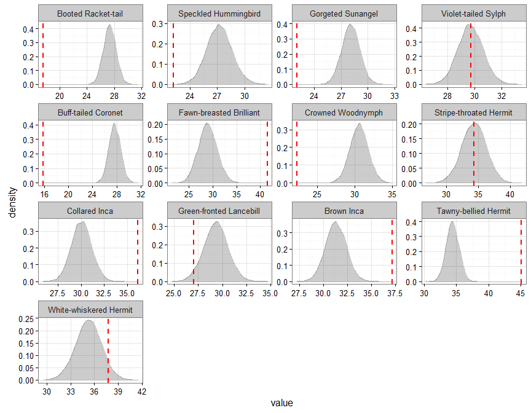

## Variance

```r
ggplot(nullframe[nullframe$variable=="sd",],aes(x=value)) + geom_density(fill="black",alpha=.2) + geom_vline(data=mtruestate[mtruestate$variable=="sd",],aes(xintercept=value),linetype="dashed",col="red") + facet_wrap(~Hummingbird,scales="free") + theme_bw()
```


Are those true distributions within reasonable confidence bands?


```r
sdat<-split(nullframe,nullframe$variable)
tstate<-sapply(sdat,function(d){
  sp<-split(d,d$Hummingbird,drop = T)
  l<-sapply(sp,function(y){
    #true state
    ts<-true_state[true_state$Hummingbird %in% unique(y$Hummingbird),as.character(unique(d$variable))]
    f<-ecdf(y$value)
    f(ts[[1]])
  })
})

#melt for plotting
mtstate<-melt(tstate)

ord<-hum.morph %>% arrange(desc(Bill)) %>% select(English) %>% .$English

mtstate$Var1<-factor(mtstate$Var1,levels=ord)

p<-ggplot(mtstate,aes(x=Var1,y=Var2,fill=(value<0.05 | value > 0.95))) + geom_tile() + coord_flip() + labs(x="Hummingbird",y="Metric",fill="Difference between\nObserved and Null Distribution\n(alpha=0.05)") + ggtitle("Used versus Background")
p
```


#Randomization II


```r
#true state
true_state<- indat %>% filter(State=="Used") %>% group_by(Hummingbird) %>% summarize(mean=mean(Traitmatch),sd=sd(TotalCorolla))

mtruestate<-melt(true_state,measure.vars=c("mean","sd"))

#randomization function
nullc<-function(indat){
  indat$State<-sample(indat$State)
null_state<- indat %>% filter(State=="Used") %>% group_by(Hummingbird) %>% summarize(mean=mean(Traitmatch),sd=sd(TotalCorolla))

  return(null_state)
}

cl<-makeCluster(5,"SOCK")
registerDoSNOW(cl)
nullframe<-foreach(x=1:10000,.packages="dplyr") %dopar% {nullc(indat)}
stopCluster(cl)

names(nullframe)<-1:10000
nullframe<-melt(nullframe,id.vars=c("Hummingbird"))
```

#Compare null and observed distributions

## Mean Trait-matching


```r
ggplot(nullframe[nullframe$variable=="mean",],aes(x=value)) + geom_density(fill="black",alpha=.2) + geom_vline(data=mtruestate[mtruestate$variable=="mean",],aes(xintercept=value),linetype="dashed",col="red",size=1) + facet_wrap(~Hummingbird,scales="free") + theme_bw() 
```

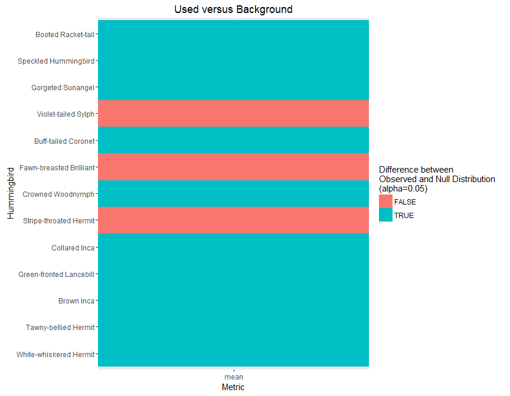

Are those true distributions within reasonable confidence bands?


```r
sdat<-split(nullframe,nullframe$variable)
tstate<-sapply(sdat,function(d){
  sp<-split(d,d$Hummingbird,drop = T)
  l<-sapply(sp,function(y){
    #true state
    ts<-true_state[true_state$Hummingbird %in% unique(y$Hummingbird),as.character(unique(d$variable))]
    f<-ecdf(y$value)
    f(ts[[1]])
  })
})

#melt for plotting
mtstate<-melt(tstate)

ord<-hum.morph %>% arrange(desc(Bill)) %>% select(English) %>% .$English

mtstate$Var1<-factor(mtstate$Var1,levels=ord)

p2<-ggplot(mtstate[mtstate$Var2 == 'mean',],aes(x=Var1,y=Var2,fill=(value<0.05))) + geom_tile() + coord_flip() + labs(x="Hummingbird",y="Metric",fill="Difference between\nObserved and Null Distribution\n(alpha=0.05)") + ggtitle("Used versus Background")
p2
```

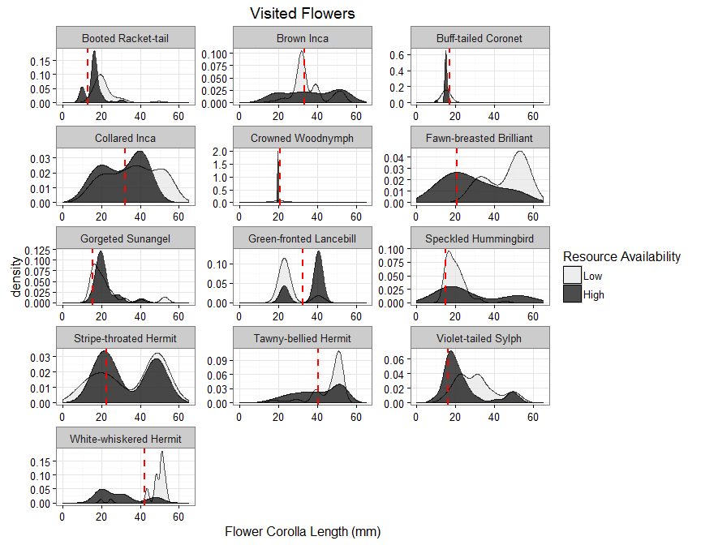

#Randomization III

Do the distributions of corollas used differ in resource periods, given the background in each time period?

Do they expand, contract, or shift?


```r
ggplot(indat[indat$State=="Used",],aes(x=TotalCorolla,fill=as.factor(Availability))) + geom_density(alpha=.7) + facet_wrap(~Hummingbird,scales="free",ncol=3) + theme_bw() + scale_fill_manual("Resource Availability",labels=c("Low","High"),values=c("Red","Black")) + ggtitle("Visited Flowers") + geom_vline(data=b,aes(xintercept=Bill),linetype="dashed",size=1,col='red') + scale_fill_manual("Resource Availability",values=c("grey90","black"),labels=c("Low","High")) + xlab("Flower Corolla Length (mm)") + xlim(0,65)
```

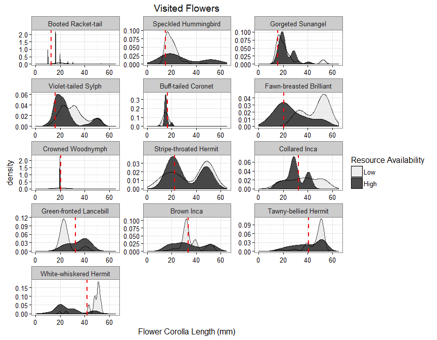

##True state of trait-matching among high and low periods.

```r
true_state<- indat %>% filter(State=="Used") %>% group_by(Hummingbird,Availability) %>% summarize(mean=mean(TotalCorolla),sd=sd(TotalCorolla)) 

mtruestate<-melt(true_state,measure.vars=c("mean","sd"))

#difference in values
splt<-split(mtruestate,list(true_state$Hummingbird,mtruestate$variable),drop=T)

diffdf<-lapply(splt,function(x){
  cx<-acast(x,Availability~variable,value.var="value")
  return(data.frame(Hummingbird=unique(x$Hummingbird),Metric=unique(x$variable),Difference=diff(cx)[[1]]))
  })

truedf<-rbind_all(diffdf)
```


```r
#Define randomization function

nullc<-function(indat){
  
  #randomize 
  indat$Availability<- sample(indat$Availability)
  indat$State<-sample(indat$State)
  
  #Calculate null
true_state<- indat %>% filter(State=="Used") %>% group_by(Hummingbird,Availability) %>% summarize(mean=mean(TotalCorolla),sd=sd(TotalCorolla))

mtruestate<-melt(true_state,measure.vars=c("mean","sd"))

#difference in values
splt<-split(mtruestate,list(true_state$Hummingbird,mtruestate$variable),drop=T)

diffdf<-lapply(splt,function(x){
  cx<-acast(x,Availability~variable,value.var="value")
  return(data.frame(Hummingbird=unique(x$Hummingbird),Metric=unique(x$variable),Difference=diff(cx)[[1]]))
  })

null_state<-rbind_all(diffdf)

  return(null_state)
}

cl<-makeCluster(5,"SOCK")
registerDoSNOW(cl)
nullframe<-foreach(x=1:1000,.packages=c("dplyr","reshape2")) %dopar% {nullc(indat)}
stopCluster(cl)

nullframe<-rbind_all(nullframe)
```

## Mean Difference in Corollas


```r
ggplot(data=nullframe[nullframe$Metric=="mean",],aes(x=Difference)) + geom_density(fill="black",alpha=.2) + geom_vline(data=truedf[truedf$Metric=="mean",],aes(xintercept=Difference),linetype="dashed",col="red")+ facet_wrap(~Hummingbird,scales="free") + theme_bw() + ggtitle("Is the mean corolla length different in high and low periods")
```

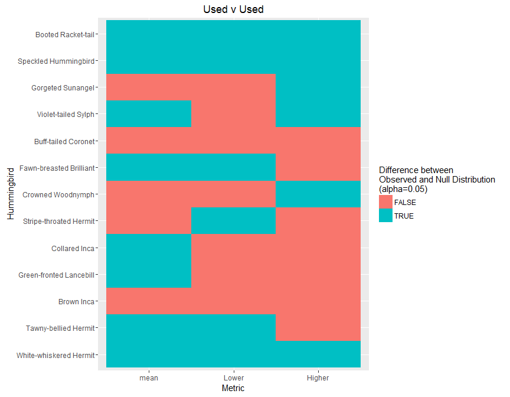

## Difference in sd of Corollas


```r
ggplot(data=nullframe[nullframe$Metric=="sd",],aes(x=Difference)) + geom_density(fill="black",alpha=.2) + geom_vline(data=truedf[truedf$Metric=="sd",],aes(xintercept=Difference),linetype="dashed",col="red")+ facet_wrap(~Hummingbird,scales="free") + theme_bw() + ggtitle("Is the variance in  trait-matching different in high and low periods")
```

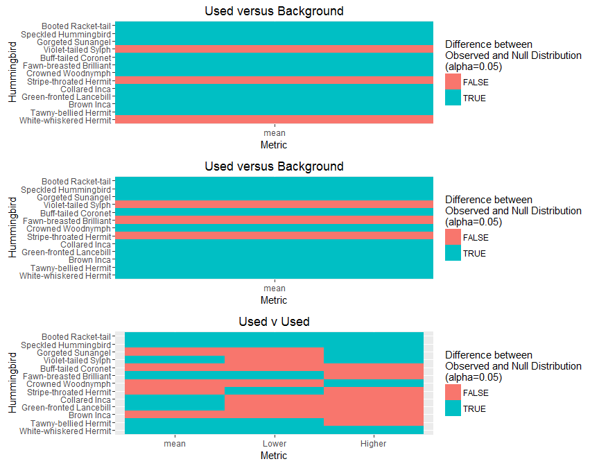


Are those true distributions within reasonable confidence bands?


```r
sdat<-split(nullframe,nullframe$Metric)
tstate<-sapply(sdat,function(d){
  sp<-split(d,d$Hummingbird,drop=T)
  l<-sapply(sp,function(y){
    #true state
    ts<-truedf[truedf$Hummingbird %in% unique(y$Hummingbird) & truedf$Metric %in% unique(y$Metric),"Difference"]
    
    f<-ecdf(y$Difference)
    f(ts[[1]])
  })
})

#melt for plotting
mtstate<-melt(tstate)

ord<-hum.morph %>% arrange(desc(Bill)) %>% select(English) %>% .$English

mtstate$Var1<-factor(mtstate$Var1,levels=ord)

#order by billsize
p3<-ggplot(mtstate[mtstate$Var2 %in% c("mean","sd"),],aes(x=Var1,y=Var2,fill=(value<0.05 | value > 0.95))) + geom_tile() + coord_flip() + labs(x="Hummingbird",y="Metric",fill="Difference between\nObserved and Null Distribution\n(alpha=0.05)") + ggtitle("Used v Used")
p3
```


#View all randomization tests.
*

```r
grid.arrange(p,p2,p3,ncol=1)
```

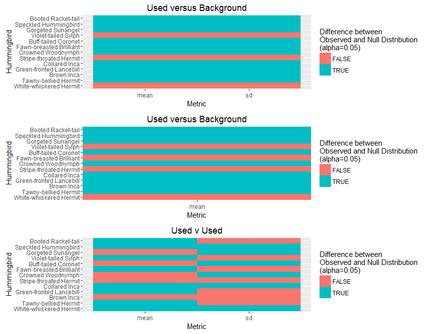

Regardless of identity, does the community converge on a corolla length, what is the space used in each time period


```r
ggplot(indat[indat$State=="Used",],aes(fill=as.factor(Availability),x=TotalCorolla)) + geom_density(alpha=.75)+ scale_fill_manual("Resource Availability",values = c("grey90","black"),labels=c("Low","High")) + theme_bw() + geom_vline(xintercept=c(16.23,19.78),linetype="dashed")
```

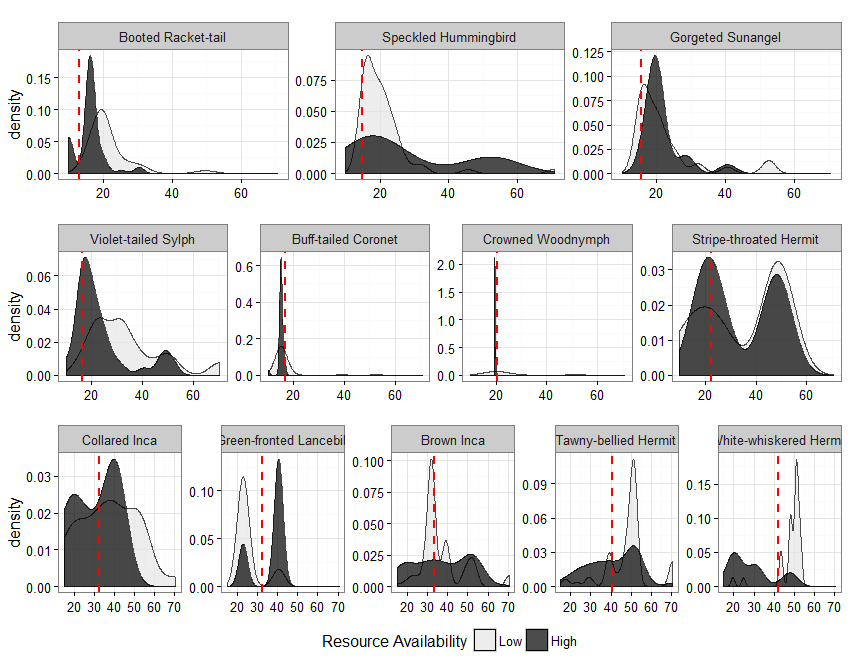

```r
ggsave("Figures/AllCorollas.svg",height=4,width=6)
```


```r
#Order by bill length
indat$Hummingbird<-factor(indat$Hummingbird,levels=as.character(b[order(b$Bill),]$Hummingbird))
keep<-c("Tawny-bellied Hermit","White-whiskered Hermit","Brown Inca","Violet-tailed Sylph")

#loop through plots, by bill length.
b$Billc<-cut(b$Bill,breaks=c(0,16,30,60),labels=c("Short Bill","Medium Bill","Long Bill"))

indat<-merge(indat,b[,!colnames(b) %in% "Bill"])
```


```r
#loop through plots
p<-list()

#do we have enough senses.
m<-melt(table(indat$State,indat$Hummingbird,indat$Availability))

#take out fawn breasted brilliant
indat<-indat[!indat$Hummingbird %in% "Fawn-breasted Brilliant",]
#split data

sindat<-split(indat,indat$Billc)

#vectors of titles
for (x in 1:length(sindat)){
  j<-sindat[[x]]
  p[[x]]<-ggplot(j[j$State=="Used",],aes(x=TotalCorolla,fill=as.factor(Availability))) + geom_density(alpha=.7) + facet_wrap(~Hummingbird,scale="free_y",nrow=1) + theme_bw()   + geom_vline(aes(xintercept=Bill),linetype="dashed",size=1,col='red') + labs(x=NULL) + scale_fill_manual("Resource Availability",values=c("grey90","black"),labels=c("Low","High"),guide="none") + scale_x_continuous(limits=c(0,70),breaks=c(0,20,40,60)) + theme(plot.margin=unit(c(.6,.6,0.1,0.1),"cm"))
}

#just add legend to last one.
p[[3]]<-p[[3]]+theme(legend.position='bottom') + scale_fill_manual("Resource Availability",values=c("grey90","black"),labels=c("Low","High"))
svg("Figures/ChangeCorolla_used.svg",height=8,width=10)
grid.arrange(p[[1]],p[[2]],p[[3]],heights=c(0.3,.3,0.4))
dev.off()
```

```
## png 
##   2
```

```r
grid.arrange(p[[1]],p[[2]],p[[3]],heights=c(0.3,.3,0.4))
```

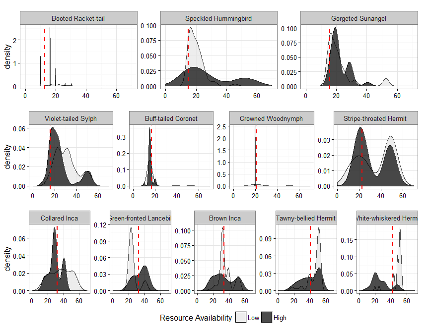

Save image


```r
save.image("Randomization.Rdata")
```
