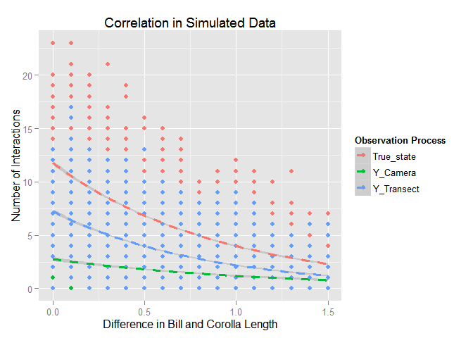
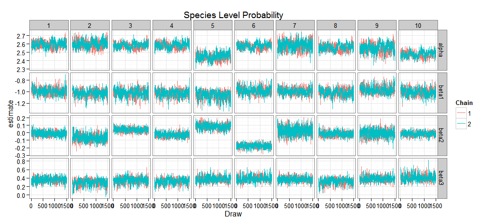
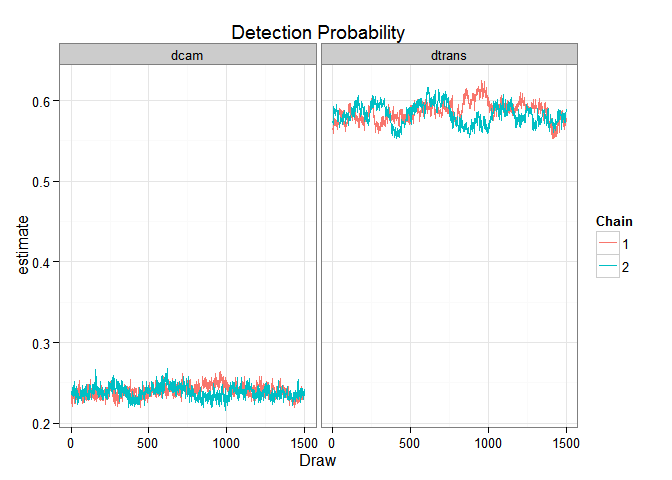
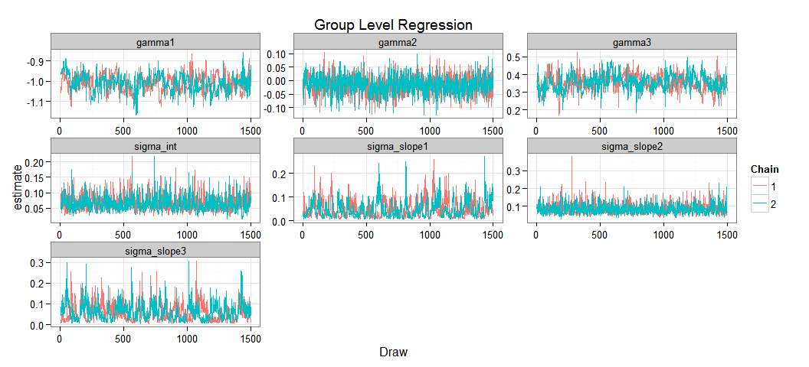
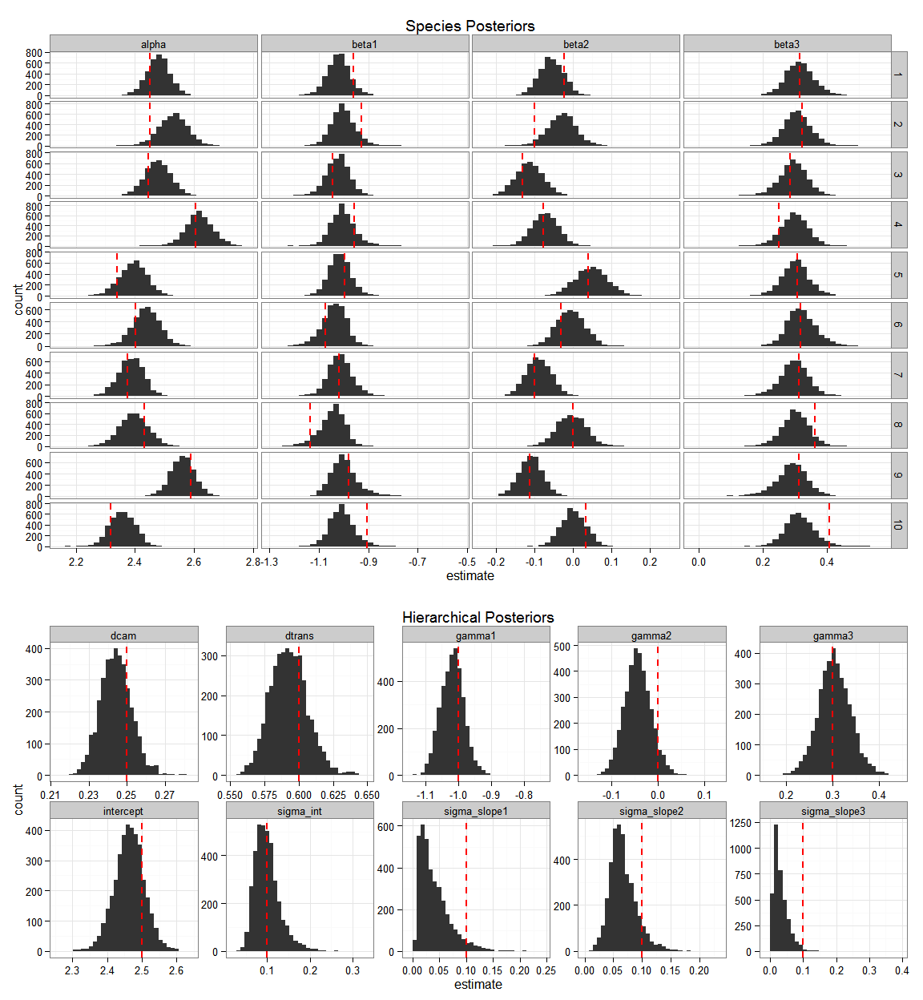
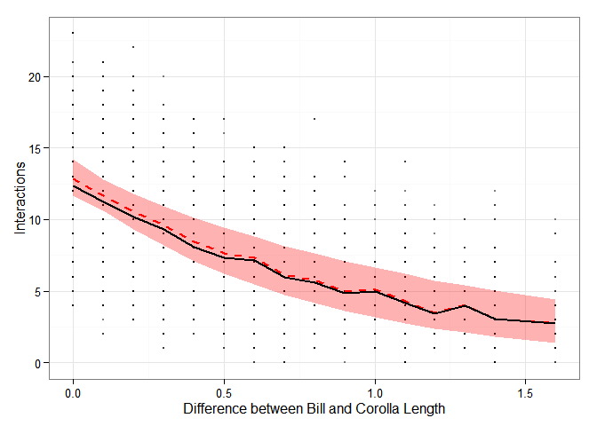
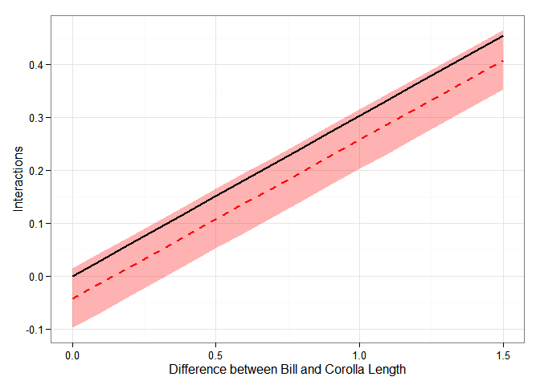

# Simulated Data for Two Detection Methods for Observing Species Interactions
Ben Weinstein  
December 25, 2015  

#Summary

There is some underlying intensity of interactions between hummingbird species  i and plant species j. We observe these interactions using transects across elevation ranges and cameras at individual flowers. To combine these data to jointly estimate the importance of trait-matching and resources on interaction intensity we need a hierarchical occupancy model that accounts for 1) the difference in sampling effort between survey types, 2) The variable number of replicates per species, 3) The difference in detectability of interactions based on survey type. The occupancy model below uses months as our estimated latent state. There are two surveys per month, and a variable number of cameras for each flower, often with no cameras on a given flower in a month. The model below was able to capture true simulated parameters that mimic our observed data.

# True Simulated values

Hummingbird Species =10

Plant Species=20

Survey Periods = 24

Detection Probability for Camera = 0.25

Detection Probability for Transect = 0.6

Group Intercept

* intercept<-2.5

* sigma_intercept<- 0.1

Effect of Trait-matching

* gamma1=-1

* sigma_slope1<- 0.1

Effect of Resources

* gamma2=0

* sigma_slope2<- 0.1

Interaction effect of resources * traitmatch

* gamma3=0.3

* sigma_slope3<- 0.1

Bill sizes
Bill<-rpois(h_species,10)

Corolla sizes

Corolla<-rpois(plant_species,15)

Survey periods are 70% cameras, 30% Transect
Transects have two replicates.Cameras have variable number of replicates, modeled as rpois(lambda=0.5).

Resources are scored as either 'High' or 'Low' and is modeled as rbinom(n=1,size=1,prob=0.5)

# Observed Data

 

#Hierarchical Occupancy Model

For hummingbird species i feeding on plant species j observed at time k and sampling event d. 

$$ YTransect_{i,j,k,d} \sim B(N_{i,j,k},\omega_{Transect}) $$

$$ YCamera_{i,j,k,d} \sim B(N_{i,j,k},\omega_{Camera}) $$
$$ \omega_{Camera} <- \phi_{Camera} * EffortCamera_k $$
$$ \omega_{Transect} <- \phi_{Transect}* EffortTransect_k $$
$$ N_{i,j,k} \sim Pois(\lambda_{i,j,k}) $$
$$ log(\lambda_{i,j,k}) = \alpha_i + \beta_{1,i} * Traitmatch_{i,j} + \beta_{2,i} *Resources_k + \beta_{3,i} * Traitmatch_{i,j} * Resources_k $$

**Priors**

$$ \phi_{Camera} \sim U(0,1) $$
$$ \phi_{Transect} \sim U(0,1) $$
$$\alpha_i \sim N(intercept,\tau_{\alpha})$$
$$\beta_{1,i} \sim N(\gamma_1i,\tau_{\beta_1})$$
$$\beta_{2,i} \sim N(\gamma_2i,\tau_{\beta_2})$$
$$\beta_{3,i} \sim N(\gamma_3i,\tau_{\beta_3})$$

**Hyperpriors**

Group Level Means

$$\gamma_{1,i} \sim N(0,0.0001)$$
$$\gamma_{2,i} \sim N(0,0.0001)$$
$$\gamma_{3,i} \sim N(0,0.0001)$$
$$ intercept \sim N(0,0.0001)$$

Group Level Variance

$$\tau_{\alpha} \sim Gamma(0.0001,0.0001)$$
$$\tau_\beta1 \sim Gamma(0.0001,0.0001)$$
$$\tau_\beta2 \sim Gamma(0.0001,0.0001)$$
$$\tau_\beta3 \sim Gamma(0.0001,0.0001)$$

**Derived quantities**

$$\sigma_{intercept} = \sqrt[2]{\frac{1}{\tau_\alpha}}$$
$$\sigma_{slope1} = \sqrt[2]{\frac{1}{\tau_{\beta_1}}}$$
$$\sigma_{slope2} = \sqrt[2]{\frac{1}{\tau_{\beta_2}}}$$
$$\sigma_{slope3} = \sqrt[2]{\frac{1}{\tau_{\beta_3}}}$$

# Analysis of observed data

###Assess Convergence

 

 

 

###Posteriors

 

###Predicted Relationship 

#Predicted Relationship

 

The true data is plotted overtop the simulation relationship in black, and the predicted relationship in dashed red with pink CI intervals.

## Trait by Resource Interaction

 

