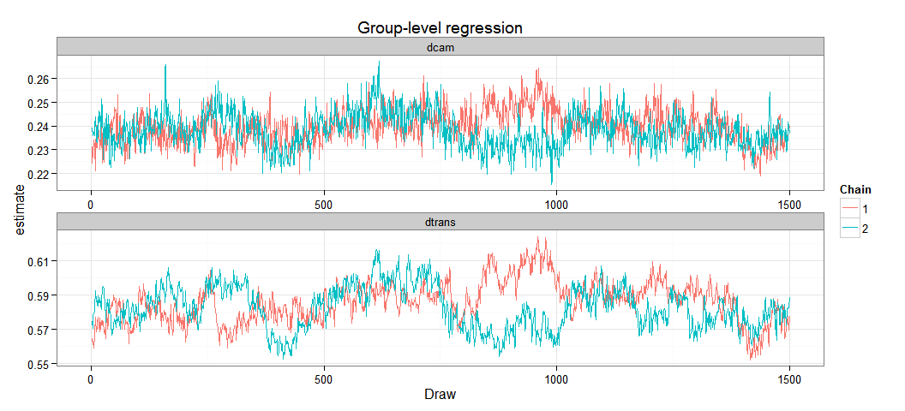

# TwoDetectSimulation
Ben Weinstein  
December 25, 2015  


```r
#load("Simulation_2M.RData")
```

#Simulate Data


```r
h_species=10
plant_species=20
Times=24
detection_cam=0.15
detection_trans=0.6

#which records are camera, which are transects?
mt<-rbinom(Times,1,0.7)
mt[which(mt==1)]<-"Camera"
mt[!mt=="Camera"]<-"Transect"

#Bill sizes
Bill<-rpois(h_species,10)

#Corolla sizes
Corolla<-rpois(plant_species,15)

#Subtract both and take absolute value
traitmatch<-abs(sapply(Corolla,function(x) x - Bill)/10)

#fill out for each month
traitarray<-array(NA,dim=c(h_species,plant_species,Times))
#fill for each month
for (x in 1:Times){
  traitarray[,,x]<-traitmatch 
}

#simulate some poisson distributed resource counts for each replicate
#this will be same for each species to start with.
resources<-array(NA,dim=c(h_species,plant_species,Times))

#fill for each month
for (x in 1:Times){
  resources[,,x]<-rpois(1,10)  
}

#standardize predictors
resources<-array(data=scale(resources),dim=c(h_species,plant_species,Times))

#regression slope for trait-matching and resources
#trait match
gamma1=-0.6
intercept<-2
sigma_slope1<- 0.1
sigma_intercept<- 0.1

#resources
gamma2=0
sigma_slope2<- 0.1

#resources * traitmatch
gamma3=0.3
sigma_slope3<- 0.1

#loop through each species and plants

#draw values from hierarcichal distributions
beta1<-rnorm(h_species,gamma1,sigma_slope1)
beta2<-rnorm(h_species,gamma2,sigma_slope2)
beta3<-rnorm(h_species,gamma3,sigma_slope3)

alpha<-rnorm(h_species,intercept,sigma_intercept)

lambda<-exp(alpha + beta1 * traitarray + beta2 * resources + beta3 * resources * traitarray)

#How many cameras for each flower during each time period?
true_interactions<-array(data=sapply(lambda,function(x){rpois(1,lambda=x)}),dim=c(h_species,plant_species,Times))

#combine and melt into a single datafFrame
mdat<-dcast(melt(list(y=true_interactions,traitmatch=traitarray,resources=resources)),Var1+Var2+Var3~L1)

colnames(mdat)<-c("Bird","Plant","Time","resources","traitmatch","True_state")

#Merge the survey type
mdat<-merge(mdat,data.frame(Time=1:Times,Survey_Type=mt))

##Observation models
dat<-list()
  
for (x in 1:nrow(mdat)){
  if(mdat$Survey_Type[x]=="Transect"){
    df<-data.frame(Y_Transect=rbinom(2,mdat$True_state[x],prob=detection_trans))
    dat[[x]]<-cbind(mdat[x,],df)
  } else{
        cams<-rpois(1,0.4)
        if(cams==0){next}
        df<-data.frame(Y_Camera=rbinom(cams,mdat$True_state[x],prob=detection_cam))
        dat[[x]]<-cbind(mdat[x,],df)
  }
}

mdat<-rbind_all(dat)
```

# Observed Data


```r
mdatm<-melt(mdat,measure.vars = c("True_state","Y_Camera","Y_Transect"))

ggplot(mdatm,aes(x=traitmatch,y=value,col=variable)) + geom_point() + geom_smooth(method="glm",family="poisson",linetype="dashed",size=1.1) + ggtitle("Correlation in Simulated Data") + labs(x="Difference in Bill and Corolla Length",y="Number of Interactions",col="Observation Process")
```

 

```r
#traitmatch dataframe
Traitmatch<-mdat %>% group_by(Bird,Plant) %>% summarize(v=unique(traitmatch)) %>% acast(Bird~Plant)
```

```
## Using v as value column: use value.var to override.
```

```r
TimeResources<-mdat %>% group_by(Time,Bird) %>% summarize(v=unique(resources)) %>% acast(Bird~Time)
```

```
## Using v as value column: use value.var to override.
```

#Hierarchical Occupancy Model

For hummingbird species i feeding on plant species j observed along transect date k. 

$$ YTransect_{i,j,k} \sim B(N_{i,j,k},\omega_{Transect}) $$

$$ YCamera_{i,j,k} \sim B(N_{i,j,k},\omega_{Camera}) $$
$$ \omega_{Camera} <- \phi_{Camera} * EffortCamera_k $$
$$ \omega_{Transect} <- \phi_{Transect}* EffortTransect_k $$
$$ N_{i,j,k} \sim Pois(\lambda_{i,j,k}) $$
$$ log(\lambda_{i,j,k}) = \alpha_i + \Beta1_i * Traitmatch_{i,j} + \Beta2_i *Resources_k + \Beta3_i * Traitmatch_{i,j} * Resources_k $$

Priors
$$ \phi_{Camera} \sim U(0,1) $$
$$ \phi_{Transect} \sim U(0,1) $$

**Priors**

$$\alpha_i \sim N(intercept,\tau_{\alpha})$$
$$\beta_{1,i} \sim N(\gamma_1i,\tau_{\beta_1})$$
$$\beta_{2,i} \sim N(\gamma_2i,\tau_{\beta_2})$$
$$\beta_{3,i} \sim N(\gamma_3i,\tau_{\beta_3})$$

**Hyperpriors**

Group Level Means

$$\gamma_{1,i} \sim N(0.001,0.001)$$
$$\gamma_{2,i} \sim N(0.001,0.001)$$
$$\gamma_{3,i} \sim N(0.001,0.001)$$
$$ intercept \sim N(0.001,0.001)$$

Group Level Variance

$$\tau_{\alpha} \sim Gamma(0.001,0.001)$$
$$\tau_\beta1 \sim Gamma(0.001,0.001)$$
$$\tau_\beta2 \sim Gamma(0.001,0.001)$$
$$\tau_\beta3 \sim Gamma(0.001,0.001)$$

**Derived quantities**

$$\sigma_{int} = \frac{1}{\tau_{\alpha}}^2$$
$$\sigma_{slope1} = \frac{1}{\tau_{\beta_1}}^2$$
$$\sigma_{slope2} = \frac{1}{\tau_{\beta_2}}^2$$
$$\sigma_{slope3} = \frac{1}{\tau_{\beta_3}}^2$$

# Analysis of observed data


```r
paralleljags<-T

if(paralleljags){
    
#Source model
source("Bayesian/NmixturePoissonRagged2m.R")

#print model
writeLines(readLines("Bayesian/NmixturePoissonRagged2m.R"))

#Input Data
Dat <- c('Yobs_camera','Yobs_transect','Birds','Bird','Plant','Time','Plants','Times','resources','Nobs','cam_surveys','trans_surveys','Traitmatch')

#Inits
InitStage <- function(){
  #A blank Y matrix - all present
  initY<-array(dim=c(Birds,Plants,Times),data=max(Yobs_transect,na.rm=T))
  initB<-as.numeric(matrix(nrow=Birds,ncol=1,data=.1))

list(beta1=initB,beta2=initB,beta3=initB,alpha=rep(.5,Birds),intercept=0,tau_alpha=0.1,tau_beta1=0.1,tau_beta2=0.1,tau_beta3=0.1,gamma1=0,gamma2=0,gamma3=0,dtrans=0.5,dcam=0.5,N=initY)}

#Parameters to track
ParsStage <- c("alpha","beta1","beta2","beta3","intercept","sigma_int","sigma_slope1","sigma_slope2","sigma_slope3","gamma1","gamma2","gamma3","dtrans","dcam")

#MCMC options

ni <- 15000  # number of draws from the posterior
nt <- max(c(1,ni*.0001))  #thinning rate
nb <- ni*.85 # number to discard for burn-in
nc <- 2  # number of chains

#Jags

  Yobs_camera = mdat$Y_Camera
  Yobs_transect = mdat$Y_Transect
  Birds=max(mdat$Bird)
  Bird=mdat$Bird
  Plant=mdat$Plant
  Time=mdat$Time
  Plants=max(mdat$Plant)
  Times=max(mdat$Time)
  resources=TimeResources
  Nobs=nrow(mdat)
  cam_surveys=(mdat$Survey_Type=="Camera")*1
  trans_surveys=(mdat$Survey_Type=="Transect")*1
  Traitmatch=Traitmatch

  m<-do.call(jags.parallel,list(Dat,InitStage,ParsStage,model.file="Bayesian/NmixturePoissonRagged2m.jags",n.thin=nt, n.iter=ni,n.burnin=nb,n.chains=nc))
  
} else {
  
#Source model
source("Bayesian/NmixturePoissonRagged2m.R")

#print model
writeLines(readLines("Bayesian/NmixturePoissonRagged2m.R"))

#Input Data
Dat <- list(
  Yobs_camera = mdat$Y_Camera,
  Yobs_transect = mdat$Y_Transect,
  Birds=max(mdat$Bird),
  Bird=mdat$Bird,
  Plant=mdat$Plant,
  Time=mdat$Time,
  Plants=max(mdat$Plant),
  Times=max(mdat$Time),
  resources=TimeResources,
  Nobs=nrow(mdat),
  cam_surveys=(mdat$Y_Camera>0)*1,
  trans_surveys=(mdat$Y_Transect>0)*1,
  Traitmatch=Traitmatch)

#A blank Y matrix - all present
initY<-array(dim=c(Dat$Birds,Dat$Plants,Dat$Times),data=max(mdat$Y_Transect,na.rm=T))
initB<-as.numeric(matrix(nrow=h_species,ncol=1,data=.1))

#Inits
InitStage <- function(){list(beta1=initB,beta2=initB,beta3=initB,alpha=rep(.5,Dat$Birds),intercept=0,tau_alpha=0.1,tau_beta1=0.1,tau_beta2=0.1,tau_beta3=0.1,gamma1=0,gamma2=0,gamma3=0,dtrans=0.5,dcam=0.5,N=initY)}

#Parameters to track
ParsStage <- c("alpha","beta1","beta2","beta3","intercept","sigma_int","sigma_slope1","sigma_slope2","sigma_slope3","gamma1","gamma2","gamma3","dtrans","dcam")

#MCMC options

ni <- 20000  # number of draws from the posterior
nt <- max(c(1,ni*.0001))  #thinning rate
nb <- ni*.90 # number to discard for burn-in
nc <- 2  # number of chains

#Jags

m = jags(inits=InitStage,
         n.chains=nc,
         model.file="Bayesian/NmixturePoissonRagged2m.jags",
         working.directory=getwd(),
         data=Dat,
         parameters.to.save=ParsStage,
         n.thin=nt,
         n.iter=ni,
         n.burnin=nb,
         DIC=T)
}
```

```
## 
## sink("Bayesian/NmixturePoissonRagged2m.jags")
## 
## cat("
##     model {
##     #Compute intensity for each pair of birds and plants
##     for (i in 1:Birds){
##     for (j in 1:Plants){
##     for (k in 1:Times){
##     
##     #Process Model
##     log(lambda[i,j,k])<-alpha[i] + beta1[i] * Traitmatch[i,j] + beta2[i] * resources[i,k] + beta3[i] * Traitmatch[i,j] * resources[i,k]
##     
##     #True number of interactions
##     N[i,j,k] ~ dpois(lambda[i,j,k])
##     }
##     }
##     }
## 
## 
##     #Observed counts for each day of sampling
## 
##     for (x in 1:Nobs){
##     
##     #Observation Process for cameras
##     detect_cam[x]<-dcam * cam_surveys[x]
## 
##     #Observation Process for transects
##     detect_transect[x]<-dtrans * trans_surveys[x]
## 
##     Yobs_camera[x] ~ dbin(detect_cam[x],N[Bird[x],Plant[x],Time[x]])    
##     Yobs_transect[x] ~ dbin(detect_transect[x],N[Bird[x],Plant[x],Time[x]])    
## 
##     #Assess Model Fit
##     #ignore this for now.
##     
##     #Fit discrepancy statistics
##     #eval[x]<-detect[Bird[x]]*N[Bird[x],Plant[x],Camera[x]]
##     #E[x]<-pow((Yobs[x]-eval[x]),2)/(eval[x]+0.5)
##     
##     #ynew[x]~dbin(detect[Bird[x]],N[Bird[x],Plant[x],Camera[x]])
##     #E.new[x]<-pow((ynew[x]-eval[x]),2)/(eval[x]+0.5)
##     
##     }
##     
##     #Species level priors
##     
##     for (i in 1:Birds){
##     alpha[i] ~ dnorm(intercept,tau_alpha)
##     beta1[i] ~ dnorm(gamma1,tau_beta1)    
##     beta2[i] ~ dnorm(gamma2,tau_beta2)    
##     beta3[i] ~ dnorm(gamma3,tau_beta3)    
##     }
##     
##     #Detect priors
##     dcam ~ dunif(0,1)
##     dtrans ~ dunif(0,1)
## 
##     #Hyperpriors
##     #Slope grouping
##     gamma1~dnorm(0,0.0001)
##     gamma2~dnorm(0,0.0001)
##     gamma3~dnorm(0,0.0001)
##     
##     #Intercept grouping
##     intercept~dnorm(0,0.0001)
##     
##     # Group intercept variance
##     tau_alpha ~ dgamma(0.0001,0.0001)
##     sigma_int<-pow(1/tau_alpha,0.5) 
##     
##     #Derived Quantity
##     
##     #Slope variance, turning precision to sd
##     
##     #Group Effect of traits
##     tau_beta1 ~ dgamma(0.0001,0.0001)
##     sigma_slope1<-pow(1/tau_beta1,0.5)
##     
##     #Group Effect of Resources
##     tau_beta2 ~ dgamma(0.0001,0.0001)
##     sigma_slope2<-pow(1/tau_beta2,0.5)
##     
##     #Group Effect of Resources * Traits
##     tau_beta3 ~ dgamma(0.0001,0.0001)
##     sigma_slope3<-pow(1/tau_beta3,0.5)
##     
##     #derived posterior check
##     #fit<-sum(E[]) #Discrepancy for the observed data
##     #fitnew<-sum(E.new[])
##     
##     }
##     ",fill=TRUE)
## 
## sink()
```


```r
pars<-extract_par(m)
```

###Assess Convergence


```r
###Chains
ggplot(pars[pars$par %in% c("alpha","beta1","beta2","beta3"),],aes(x=Draw,y=estimate,col=as.factor(Chain))) + geom_line() + facet_grid(par~species,scale="free") + theme_bw() + labs(col="Chain") + ggtitle("Species Level Probability")
```

 


```r
ggplot(pars[pars$par %in% c("dcam","dtrans"),],aes(x=Draw,y=estimate,col=as.factor(Chain))) + geom_line() + facet_grid(par~species,scale="free") + theme_bw() + labs(col="Chain") + ggtitle("Detection Probability")
```

 


```r
ggplot(pars[pars$par %in% c("gamma1","gamma2","gamma3","sigma_int","sigma_slope1","sigma_slope2","sigma_slope3"),],aes(x=Draw,y=estimate,col=as.factor(Chain))) + geom_line() + theme_bw() + labs(col="Chain") + ggtitle("Group Level Regression") + facet_wrap(~par,scales="free")
```

 

```r
ggplot(pars[pars$par %in% c("dtrans","dcam"),],aes(x=Draw,y=estimate,col=as.factor(Chain))) + geom_line() + theme_bw() + labs(col="Chain") + ggtitle("Group-level regression") + facet_wrap(~par,scales="free",ncol=1)
```

 

###Posteriors


```r
###Posterior Distributions
p<-ggplot(pars[pars$par %in% c("alpha","beta1","beta2","beta3"),],aes(x=estimate)) + geom_histogram() + ggtitle("Estimate of parameters") + facet_grid(species~par,scales="free") + theme_bw() + ggtitle("Species Posteriors")

#Add true values
tr<-melt(data.frame(species=1:h_species,alpha=alpha,beta1=beta1,beta2=beta2,beta3=beta3),id.var='species')
colnames(tr)<-c("species","par","value")
psim<-p + geom_vline(data=tr,aes(xintercept=value),col='red',linetype='dashed',size=1)
#ggsave("Figures/SimulationPosteriors.jpg",dpi=300,height=8,width=8)
```


```r
p<-ggplot(pars[pars$par %in% c("gamma1","gamma2","gamma3","intercept","sigma_int","sigma_slope1","sigma_slope2","sigma_slope3","dcam","dtrans"),],aes(x=estimate)) + geom_histogram() + ggtitle("Hierarchical Posteriors") + facet_wrap(~par,scale="free",nrow=2) + theme_bw() 

#Add true values
tr<-melt(list(gamma1=gamma1,gamma2=gamma2,gamma3=gamma3,intercept=intercept,sigma_int=sigma_intercept,sigma_slope1=sigma_slope1,sigma_slope2=sigma_slope2,sigma_slope3=sigma_slope3,dtrans=detection_trans,dcam=detection_cam))

colnames(tr)<-c("value","par")

psim2<-p + geom_vline(data=tr,aes(xintercept=value),linetype='dashed',size=1,col="red")
#ggsave("Figures/SimulationH.jpg",dpi=300,height=4,width=10)
grid.arrange(psim,psim2,heights=c(.6,.4))
```

```
## stat_bin: binwidth defaulted to range/30. Use 'binwidth = x' to adjust this.
## stat_bin: binwidth defaulted to range/30. Use 'binwidth = x' to adjust this.
## stat_bin: binwidth defaulted to range/30. Use 'binwidth = x' to adjust this.
## stat_bin: binwidth defaulted to range/30. Use 'binwidth = x' to adjust this.
## stat_bin: binwidth defaulted to range/30. Use 'binwidth = x' to adjust this.
## stat_bin: binwidth defaulted to range/30. Use 'binwidth = x' to adjust this.
## stat_bin: binwidth defaulted to range/30. Use 'binwidth = x' to adjust this.
## stat_bin: binwidth defaulted to range/30. Use 'binwidth = x' to adjust this.
## stat_bin: binwidth defaulted to range/30. Use 'binwidth = x' to adjust this.
## stat_bin: binwidth defaulted to range/30. Use 'binwidth = x' to adjust this.
## stat_bin: binwidth defaulted to range/30. Use 'binwidth = x' to adjust this.
## stat_bin: binwidth defaulted to range/30. Use 'binwidth = x' to adjust this.
## stat_bin: binwidth defaulted to range/30. Use 'binwidth = x' to adjust this.
## stat_bin: binwidth defaulted to range/30. Use 'binwidth = x' to adjust this.
## stat_bin: binwidth defaulted to range/30. Use 'binwidth = x' to adjust this.
## stat_bin: binwidth defaulted to range/30. Use 'binwidth = x' to adjust this.
## stat_bin: binwidth defaulted to range/30. Use 'binwidth = x' to adjust this.
## stat_bin: binwidth defaulted to range/30. Use 'binwidth = x' to adjust this.
## stat_bin: binwidth defaulted to range/30. Use 'binwidth = x' to adjust this.
## stat_bin: binwidth defaulted to range/30. Use 'binwidth = x' to adjust this.
## stat_bin: binwidth defaulted to range/30. Use 'binwidth = x' to adjust this.
## stat_bin: binwidth defaulted to range/30. Use 'binwidth = x' to adjust this.
## stat_bin: binwidth defaulted to range/30. Use 'binwidth = x' to adjust this.
## stat_bin: binwidth defaulted to range/30. Use 'binwidth = x' to adjust this.
## stat_bin: binwidth defaulted to range/30. Use 'binwidth = x' to adjust this.
## stat_bin: binwidth defaulted to range/30. Use 'binwidth = x' to adjust this.
## stat_bin: binwidth defaulted to range/30. Use 'binwidth = x' to adjust this.
## stat_bin: binwidth defaulted to range/30. Use 'binwidth = x' to adjust this.
## stat_bin: binwidth defaulted to range/30. Use 'binwidth = x' to adjust this.
## stat_bin: binwidth defaulted to range/30. Use 'binwidth = x' to adjust this.
## stat_bin: binwidth defaulted to range/30. Use 'binwidth = x' to adjust this.
## stat_bin: binwidth defaulted to range/30. Use 'binwidth = x' to adjust this.
## stat_bin: binwidth defaulted to range/30. Use 'binwidth = x' to adjust this.
## stat_bin: binwidth defaulted to range/30. Use 'binwidth = x' to adjust this.
## stat_bin: binwidth defaulted to range/30. Use 'binwidth = x' to adjust this.
## stat_bin: binwidth defaulted to range/30. Use 'binwidth = x' to adjust this.
## stat_bin: binwidth defaulted to range/30. Use 'binwidth = x' to adjust this.
## stat_bin: binwidth defaulted to range/30. Use 'binwidth = x' to adjust this.
## stat_bin: binwidth defaulted to range/30. Use 'binwidth = x' to adjust this.
## stat_bin: binwidth defaulted to range/30. Use 'binwidth = x' to adjust this.
## stat_bin: binwidth defaulted to range/30. Use 'binwidth = x' to adjust this.
## stat_bin: binwidth defaulted to range/30. Use 'binwidth = x' to adjust this.
## stat_bin: binwidth defaulted to range/30. Use 'binwidth = x' to adjust this.
## stat_bin: binwidth defaulted to range/30. Use 'binwidth = x' to adjust this.
## stat_bin: binwidth defaulted to range/30. Use 'binwidth = x' to adjust this.
## stat_bin: binwidth defaulted to range/30. Use 'binwidth = x' to adjust this.
## stat_bin: binwidth defaulted to range/30. Use 'binwidth = x' to adjust this.
## stat_bin: binwidth defaulted to range/30. Use 'binwidth = x' to adjust this.
## stat_bin: binwidth defaulted to range/30. Use 'binwidth = x' to adjust this.
## stat_bin: binwidth defaulted to range/30. Use 'binwidth = x' to adjust this.
```

 

###Predicted Relationship 


```r
castdf<-dcast(pars[pars$par %in% c("gamma1","gamma2","gamma3","intercept"),], Chain + Draw~par,value.var="estimate")

trajF<-function(alpha,beta1,beta2,beta3,x,resources){
  indat<-data.frame(alpha,beta1,beta2,beta3)
  
  #fit regression for each input estimate
  sampletraj<-list()
  
  for (y in 1:nrow(indat)){
    v=exp(indat$alpha[y] + indat$beta1[y] * x + indat$beta2[y] * resources + indat$beta3[y] * x*resources)
    
    sampletraj[[y]]<-data.frame(x=as.numeric(x),y=as.numeric(v))
  }
  
  sample_all<-rbind_all(sampletraj)
  
  #Compute CI intervals
  predy<-group_by(sample_all,x) %>% summarise(lower=quantile(y,0.025,na.rm=T),upper=quantile(y,0.975,na.rm=T),mean=mean(y,na.rm=T))
}

#calculate interactions

intF<-function(alpha,beta1,beta2,beta3,x,resources){
  indat<-data.frame(alpha,beta1,beta2,beta3)
  
  #fit regression for each input estimate
  sampletraj<-list()
  
  for (y in 1:nrow(indat)){
    v=indat$beta2[y] + indat$beta3[y]  * x
    sampletraj[[y]]<-data.frame(x=as.numeric(x),y=as.numeric(v))
  }
  
  sample_all<-rbind_all(sampletraj)
  
  #Compute CI intervals
  predy<-group_by(sample_all,x) %>% summarise(lower=quantile(y,0.025,na.rm=T),upper=quantile(y,0.975,na.rm=T),mean=mean(y,na.rm=T))
}
```

#Predicted Relationship


```r
predy<-trajF(alpha=castdf$intercept,beta1=castdf$gamma1,x=as.numeric(traitarray),resources=as.numeric(apply(resources,2,unique)),beta2=castdf$gamma2,beta3=gamma3)

orig<-trajF(alpha=rnorm(2000,intercept,sigma_intercept),beta1=rnorm(2000,gamma1,sigma_slope1),beta2=rnorm(2000,gamma2,sigma_slope2),beta3=rnorm(2000,gamma3,sigma_slope3),x=as.numeric(traitarray),resources=as.numeric(apply(resources,2,unique)))

#plot and compare to original data
ggplot(data=predy,aes(x=x)) + geom_point(data=mdat,aes(x=traitmatch,y=True_state),alpha=.5,size=.5)+ geom_ribbon(aes(ymin=lower,ymax=upper),alpha=0.3,fill="red")  + geom_line(aes(y=mean),size=.8,col="red",linetype="dashed") + theme_bw() + ylab("Interactions") + geom_line(data=orig,aes(x=x,y=mean),col='black',size=1)+ xlab("Difference between Bill and Corolla Length") 
```

 

The true data is plotted overtop the simulation relationship in black, and the predicted relationship in dashed red with pink CI intervals.

## Trait by Resource Interaction


```r
predyint<-intF(alpha=castdf$intercept,beta1=castdf$gamma1,x=as.numeric(traitarray),resources=resources,beta2=castdf$gamma2,beta3=gamma3)

origint<-intF(alpha=rnorm(2000,intercept,sigma_intercept),beta1=rnorm(2000,gamma1,sigma_slope1),beta2=rnorm(2000,gamma2,sigma_slope2),beta3=rnorm(2000,gamma3,sigma_slope3),x=as.numeric(traitarray),resources=resources)

#plot and compare to original data
psim4<-ggplot(data=predyint,aes(x=x)) + geom_ribbon(aes(ymin=lower,ymax=upper),alpha=0.3,fill="red") + theme_bw() + ylab("Interactions") + geom_line(data=origint,aes(x=x,y=mean),col='black',size=1) + geom_line(aes(y=mean),size=.8,col="red",linetype="dashed") + xlab("Difference between Bill and Corolla Length") 

psim4
```

 


```r
save.image("Simulation_2M.RData")
```
